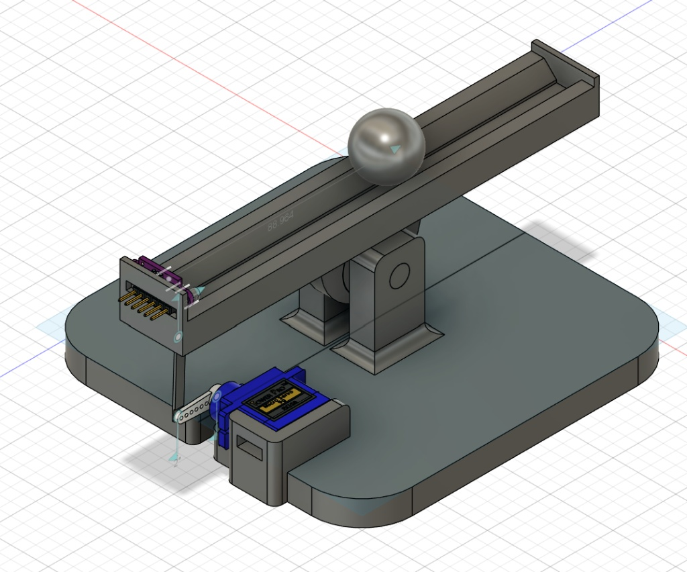

# STM32 Ball-and-Beam Closed-Loop Control System

Designed from the ground up to **mimic an industry-style, production-grade embedded software architecture**, this project implements a rigorous multi-layered abstraction model. Featuring a custom Board Support Package (BSP), decoupled peripheral drivers, and a robust, optimized PID control loop.

---

## Mechanical Design & CAD Overview

The mechanical assembly is fully custom-designed to house the servo actuator linkage, central pivot mount, and the VL53L0X Time-of-Flight sensor at the track edge:



---

## Key Features

* **Custom PID Controller**: Implements time-weighted integration (`dt`), a low-pass filtered derivative term to eliminate sensor noise jitter, and division-by-zero protection.
* **Dynamic Anti-Windup Clamping**: Scales the raw integrator limit dynamically by `1 / Ki`, turning the limit into a true, predictable degree-based ceiling to neutralize stiction without severe windup overshoot.
* **High-Speed Hardware FPU**: Leverages the ARM Cortex-M4 floating-point unit for cycle-efficient single-precision floating-point math.
* **Live Virtual COM Port Interaction**: Allows real-time monitoring via 100ms asynchronous UART logs and live setpoint adjustments directly from a terminal.

---

## System Architecture & Directory Structure

```text
ball-and-beam/
├── App/                # Core application orchestration and run loop
├── BSP/                # Board Support Package (modular peripheral wrappers)
├── Common/             # Shared system-wide definitions and error codes
├── Controls/           # PID controller logic and mathematical routines
├── Core/               # STMicroelectronics CubeMX generated HAL & core setup
├── cad/                # Mechanical assets (.step interchange and .stl meshes)
├── CMakeLists.txt
└── README.md
```

---

## Hardware & Components

* **Microcontroller**: STMicroelectronics STM32L475VG (ARM Cortex-M4 with FPU)
* **Distance Sensor**: VL53L0X Time-of-Flight (ToF) sensor communicating via I²C
* **Actuator**: Standard Servo motor driven via hardware PWM (Timer channels)
* **Development Toolchain**: CMake, Ninja, VS Code, and STM32CubeMX

---

## Control Loop Mathematics & Logic

To effectively manage physical **static friction (stiction)** near the center balance point without introducing violent limit-cycle rocking, the PID routine incorporates several safeguards:

1. **Derivative Filtering**: 
   `derivative_filtered = (alpha * prev_derivative) + ((1.0 - alpha) * raw_derivative)`
   * Smooths millimeter-level jitter from the VL53L0X sensor before the derivative term multiplies it.
2. **Scaled Integrator Clamping**: 
   `integrator_limit = degree_limit / Ki`
   * Prevents runaway accumulation while allowing the integrator to build just enough torque to break through mechanical stiction cleanly.

---

## Live Telemetry & Control

The system transmits real-time telemetry over UART every 100 ms:
```text
Distance: 77.34 mm | Set Point: 77.00 | Error: -0.34 | Integrator: -40.35
```

---

## Getting Started & Prerequisites

To successfully build, flash, and debug this project locally, your development environment requires a command-line-driven embedded toolchain. 

### 1. Required Toolset & Extensions
* **VS Code** with essential extensions:
  * *STM32Cube Extension* (or *Cortex-Debug*)
  * *CMake Tools*
  * *C/C++*
* **STM32CubeCLT (STM32 Cube Command-Line Toolset)**: Bundles the GNU Arm Embedded Toolchain (`arm-none-eabi-gcc`), programmer tools, and Ninja.
* **CMake**: Build system generator.

### 2. System PATH Configuration
For your terminal, CMake, and VS Code to compile the firmware without `command not found` errors, ensure the following directories are added to your operating system's **PATH** environment variable:

* **GNU Arm Toolchain**: `C:\ST\STM32CubeCLT\GNU-armeabi\bin` *(Provides `arm-none-eabi-gcc` cross-compiler)*
* **Ninja Build Tool**: `C:\ST\STM32CubeCLT\Ninja\bin` *(Fast-fire build runner)*
* **CMake Binaries**: `C:\Program Files\CMake\bin` *(Project preset generation)*
* **CubeProgrammer CLI**: `C:\ST\STM32CubeCLT\STM32CubeProgrammer\bin` *(Board flashing utilities)*

> **Verification:** Restart your terminal and verify your environment is configured correctly by running:
> ```bash
> cmake --version
> ninja --version
> arm-none-eabi-gcc --version
> ```

---

## Building and Flashing

1. **Clone the Repository**:
   ```bash
   git clone [https://github.com/aniranaway/ball-and-beam.git](https://github.com/aniranaway/ball-and-beam.git)
   cd ball-and-beam
   ```
2. **Configure & Build via CMake**:
   ```bash
   cmake --preset default
   cmake --build build
   ```
3. **Debug & Flash**: 
   Connect your STM32L475VG board via ST-Link. Ensure your `.vscode/launch.json` file points to the compiled artifact (`build/ball-and-beam.elf`), then launch the debug task inside VS Code or flash directly using STM32CubeProgrammer.